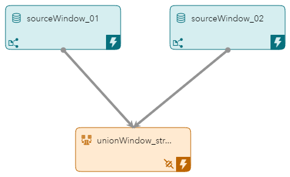
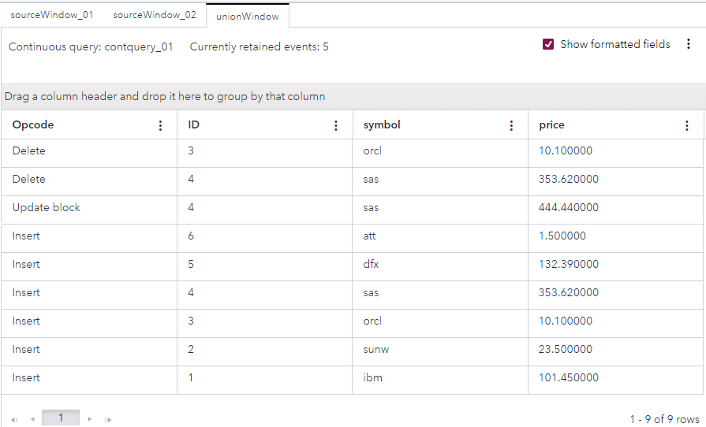

# Unifying Multiple Input Streams
## Overview

This example merges three event streams of stock market trades together. A Union window unites two or more event streams using a strict policy or a loose policy. Input windows that stream events to a Union window must have the same schema.

This example also demonstrates the use of connector orchestration.

## Source Data

The [stockpricelist1.csv](stockpricelist1.csv), [stockpricelist2.csv](stockpricelist2.csv), and [stockpricelist3.csv](stockpricelist3.csv) files contain lists of stock prices. 

## Workflow
The following figure shows the diagram of the project:

- The sourceWindow_01 window is a Source window. This is where a list of stock prices from the stockpricelist1.csv file and a list of stock prices the stockpricelist2.csv file enter the model.
- The sourceWindow_01 window is a Source window. This is where a list of stock prices from the stockpricelist3.csv file enters the model.
- The unionWindow window is a Union window. This is where the multiple lists of stock prices are merged into one list. This window also writes the results of the merge to the output.csv file.

### sourceWindow_01

Explore the settings for the sourceWindow_01 window:
1. Open the project in SAS Event Stream Processing Studio and select the sourceWindow_01 window. 
2. To examine the window's output schema, on the right toolbar, click . Observe the following fields: 
   - `ID`: This field is the stock trade's ID, which is also selected as the key field.
   - `symbol`: This field is the stock symbol. A stock symbol is a series of letters that are assigned to a security for trading purposes.
   - `price`: This field is the stock price.
3. Click . 
4. Expand **Input Data (Publisher) Connectors**. Observe that there are two publisher connectors, connected to stockpricelist1.csv and stockpricelist2.csv.  Later in these steps you observe how connector orchestration affects the order in which connectors are executed.

### sourceWindow_02

Explore the settings for the sourceWindow_02 window:
1. Select the sourceWindow_02 window in the workspace. 
2. Click . Observe that the output schema is the same as for the sourceWindow_01 window. Input windows that stream events to a Union window must have the same schema.
3. Click . 
4. Expand **Input Data (Publisher) Connectors**. Observe that there is a publisher connector, connected to stockpricelist3.csv.

### unionWindow

The unionWindow window merges multiple lists of stock prices into one list.

Explore the settings for the unionWindow window:
1. Select the unionWindow window. 
2. In the right pane, expand **State**. Observe that the window is stateful.
3. Expand **Union**. Observe that the strict policy is used for key merging. Because this window is stateful and the strict policy is used, Inserts with duplicated keys and Deletes with non-existing keys generate an error and are processed as bad records. The input files in this example do not contain such events. For more information about how different combinations of settings in the **State** and **Union** sections affect events, see [SAS Help Center: Using Union Windows](https://documentation.sas.com/?cdcId=espcdc&cdcVersion=default&docsetId=espcreatewindows&docsetTarget=n0nqt12sgro7rnn1jfg4ql0qsafw).
4. Expand **Subscriber Connectors**. Observe that there is a subscriber connector that writes output to a file called output.csv.

### Connector Orchestration

1. Click  on the main toolbar to view project properties.
2. In the right pane, expand **Connector Orchestration**. 
3. In the **Connector groups** table, observe that four connector groups are present. Open each connector group to view the connectors related to that group. For example, the `CG_sub` group relates to a subscriber connector in the unionWindow window and its target state is `Running`.
4. In the **Dependency rules** table, observe the dependency settings. For example, observe that publisher connectors are executed in the following order: 
   1. The first publisher connector in sourceWindow_01. This connector relates to stockpricelist1.csv.
   2. The publisher connector in sourceWindow_02. This connector relates to stockpricelist3.csv.
   3. The second publisher in sourceWindow_01. This connector relates to stockpricelist2.csv.

## Test the Project and View the Results

This project includes connector orchestration. As a result, it is recommended that you do not use the **Publish** button in SAS Event Stream Processing Studio's test mode to publish events from CSV files to the Source windows. Instead, edit the file paths in the connectors:
1. Edit the publisher connectors in the sourceWindow_01 and sourceWindow_02 windows so that they refer to the location in your system where you placed the CSV files. 
2. Edit the subscriber connector in the unionWindow window so that it refers to a location where the output file can be written. Ensure that the user who tests the project has Write access to that directory. 

For more information, see [SAS Help Center: Configure a File and Socket Connector](https://go.documentation.sas.com/doc/en/espcdc/default/espstudio/n0esv2n0cbbpgcn1r281krr1iv6q.htm#n0y87cwr7q5vo6n1qlfcey182vt6).

The results for each window appear in separate tabs in test mode:
- The **sourceWindow_01** tab displays the first event stream.
- The **sourceWindow_02** tab displays the second event stream.
- The **unionWindow** tab displays the unified event stream.

The following figure shows the results for the unionWindow tab:

## Additional Resources
For more information, see [SAS Help Center: Using Union Windows](https://documentation.sas.com/?cdcId=espcdc&cdcVersion=default&docsetId=espcreatewindows&docsetTarget=n0nqt12sgro7rnn1jfg4ql0qsafw).
